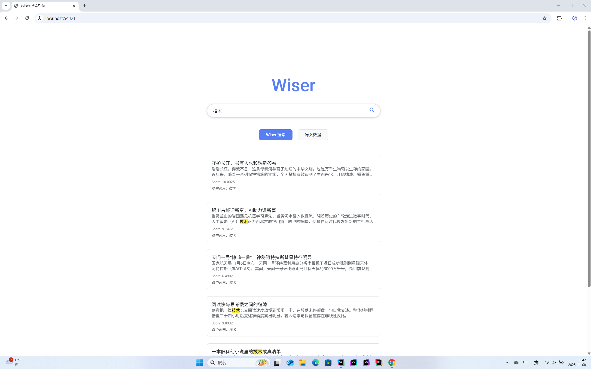
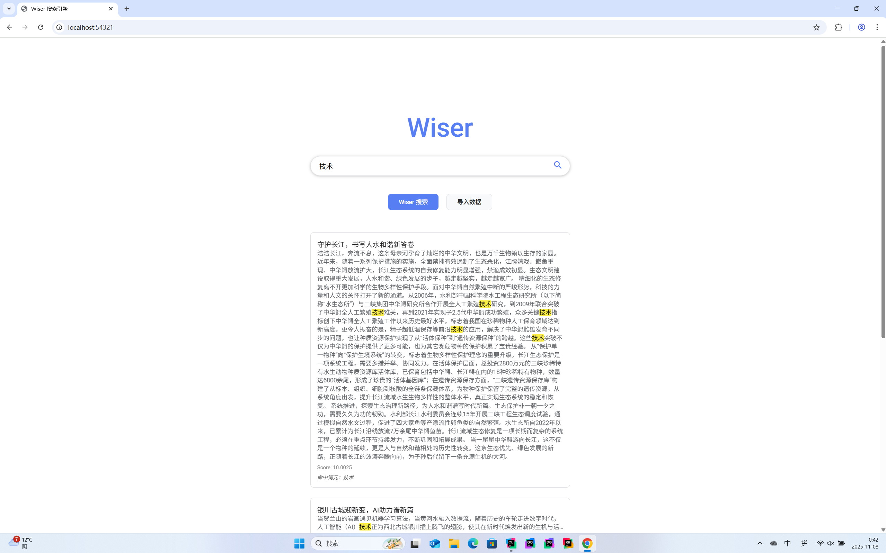

# Wiser-CPP

<p align="right">
  <b>Language:</b>
  <a href="README.en.md">English</a> | <a href="README.md">中文</a>
</p>

## Modern C++ Full-Text Search Engine

A modern C++ rewrite of the wiser full-text search engine featuring RAII, smart pointers, and STL-centric design. It is inspired by the book “How to Develop a Search Engine” (H. Yamada, T. Suenaga), with additional engineering improvements and a web UI.

### Features
- C++20 / CMake, cross-platform
- N-gram inverted index (configurable N, default 2)
- SQLite3 persistence
- Multi-format import: XML (Wikipedia), TSV, JSON (JSONL/NDJSON/array)
- Phrase search (adjacent position-chain) toggle (default OFF)
- Postings compression: golomb/none
- Tunable buffer merge threshold
- Web server + UI (wiser_web): async multi-file import, search API

### Screenshots
<p align="center">
  
</p>
<p align="center">
  
</p>

### Layout
```
wiser-cpp/
├── include/                # headers
├── src/                    # sources
├── demo/                   # demos (binaries in demo/bin)
├── web/                    # static assets (index.html/script.js/styles.css)
├── bin/ lib/               # build outputs
├── CMakeLists.txt
└── README.md
```

### Dependencies
- CMake ≥ 3.16
- C++20 compiler (MSVC 17+ / Clang 20+ / GCC 15+)
- SQLite3
- spdlog, fmt

Notes:
- If spdlog/fmt are not available, CMake falls back to FetchContent and builds them.
- SQLite3 is discovered via vcpkg (unofficial::sqlite3) first, then system (SQLite::SQLite3). You can also specify SQLITE3_INCLUDE_DIR/SQLITE3_LIBRARY manually.
- On Windows, dependent DLLs are copied next to the binaries after build and are installed with them (TARGET_RUNTIME_DLLS).

### Build
```bash
mkdir -p build && cd build
cmake .. -DCMAKE_BUILD_TYPE=Release
cmake --build . --config Release -j
```
Windows (cmd.exe):
```cmd
cmake -S . -B build -DCMAKE_BUILD_TYPE=Release
cmake --build build --config Release -j
```
Outputs:
- bin/wiser        — CLI tool (index/search)
- bin/wiser_web    — web server
- demo/bin/*       — demo binaries (not installed)

### Install (optional)
```bash
cmake --install build --config Release --prefix install
```
Installs to:
- <prefix>/bin: wiser, wiser_web (and their runtime DLLs on Windows)
- <prefix>/lib: libraries (e.g., wiser_core)
- <prefix>/web: static assets used by wiser_web
- Demos are not installed (always in demo/bin)

### Quickstart (CLI wiser)
```bash
# 1) Build a DB (auto-select loader by extension)
./bin/wiser -x web/data/sample_dataset.tsv data/wiser.db
./bin/wiser -x web/data/sample.jsonl      data/wiser.db
./bin/wiser -x web/data/sample_array.json data/wiser.db
# Wikipedia XML also supported: ./bin/wiser -x enwiki-latest-pages-articles.xml data/wiser.db

# 2) Search
./bin/wiser -q "information retrieval" data/wiser.db
```
Usage (excerpt):
```
usage: wiser [options] db_file

indexing : -x <data_file> [-m N] [-t N] [-c none|golomb]
search   : -q <query> [-s]
```

### Web server (wiser_web)
Run:
```bash
# default DB at ./wiser_web.db
./bin/wiser_web
# specify a DB path (new DB uses defaults: phrase OFF)
./bin/wiser_web my.db
# override phrase search and persist
./bin/wiser_web my.db --phrase=on
./bin/wiser_web my.db --phrase=off
```
Open http://localhost:54321 in a browser.

- Frontend:
  - Select/drag multiple files for upload;
  - The client polls tasks by IDs and shows a summary when all are done;
  - Results expandable with body previews.
- Backend:
  - Serves static files from `../web` (installed to <prefix>/web);
  - Import supports .xml / .tsv / .json / .jsonl / .ndjson; tasks are executed asynchronously in a worker pool;
  - Index writes are serialized for DB integrity;
  - Runtime settings are persisted immediately via WiserEnvironment setters (after initialize).

REST API (brief):
- GET `/api/search?q=query`
- POST `/api/import` (multipart/form-data; multiple `file` fields)
  - Response: `{ "accepted": N, "task_ids": ["...", ...] }`
- GET `/api/task?id=<task_id>`
- GET `/api/tasks`

Example (multi-file upload via curl):
```bash
curl -F "file=@web/data/sample_dataset.tsv" \
     -F "file=@web/data/sample.jsonl" \
     http://localhost:54321/api/import
```

### Settings & persistence
- After `initialize`, WiserEnvironment writes the current in-memory defaults to the DB if missing (seeding a new DB).
- Later calls to `setTokenLength` / `setPhraseSearchEnabled` / `setBufferUpdateThreshold` / `setCompressMethod` / `setMaxIndexCount` write to the DB immediately.
- wiser_web’s `--phrase=on|off` applies instantly and settings are also flushed on shutdown.
- New DB defaults: `TokenLen=2`, `PhraseSearch=off`, `BufferThreshold=2048`, `Compress=none`, `MaxIndex=-1`.

### Architecture overview
- WiserEnvironment: central configuration (immediate persistence)
- Database: SQLite3 wrapper
- Tokenizer: N-gram
- SearchEngine: query, phrase matching, TF-IDF ranking
- Postings/InvertedIndex: index structures
- Loaders: WikiLoader / TsvLoader / JsonLoader
- Web: cpp-httplib (header-only) + web UI

### Command-line options (wiser)
- Positional `db_file`
  - SQLite database file path; created if missing.
  - With `-x`: if the target DB already exists, the program errors out to prevent overwriting.
  - With `-q` only: must point to an existing DB.
- `-h`, `--help`
  - Show help and exit (code 0).
- `-x <data_file>`
  - Import data file; loader auto-selected by extension:
    - `.xml` -> Wikipedia XML
    - `.tsv` -> TSV (`title[TAB]body`, header skipped by default)
    - `.json` / `.jsonl` / `.ndjson` -> JSON (array or JSON Lines autodetected)
  - A buffer flush is triggered after import.
- `-q <search_query>`
  - Run search and print ranked results with body previews.
  - Can be combined with `-x` (index first, then search).
- `-c <compress_method>`
  - Postings compression: `none` | `golomb` (default).
  - `golomb` yields better compression at higher CPU cost; `none` is faster but larger.
  - Persisted immediately in the DB; subsequent runs reuse it.
- `-m <max_index_count>`
  - Max number of documents to index; `-1` = unlimited (default).
  - When reached, importing stops and the buffer is flushed.
- `-t <buffer_threshold>`
  - Inverted-index buffer merge threshold (default 2048). Smaller -> more frequent flushes (lower peak memory, slower import).
  - Persisted immediately in the DB.
- `-s`
  - Enable phrase search. The wiser CLI defaults to phrase search OFF; `-s` turns it OFF for the current run.
  - With phrase search ON, multi-term queries require adjacent n-grams.

### Command-line options (wiser_web)
- Positional `db_file` (optional)
  - DB file path; default `./wiser_web.db`.
  - Created if missing; new DB defaults: `PhraseSearch=off`, `TokenLen=2`, `BufferThreshold=2048`.
- `--phrase=on|off`
  - Override phrase search, apply immediately(works for existing DBs as well).
- `-h`, `--help`
  - Show usage and exit.

Behavior: wiser_web listens on `0.0.0.0:54321` and serves static files from `../web` (installed to `<prefix>/web`).

### Acknowledgments
Thanks to the authors of “How to Develop a Search Engine” and the original wiser project. This repository builds upon the structure and ideas and re-implements them in modern C++ with practical engineering improvements.
