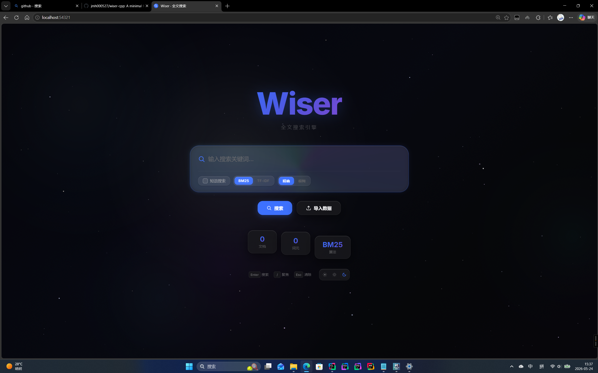

# Wiser-CPP

<p align="right">
  <b>Language:</b>
  <a href="README.en.md">English</a> | <a href="README.md">中文</a>
</p>

## 商业级 C++ 全文搜索引擎

Wiser-CPP 是一个使用现代 C++20 构建的高性能全文搜索引擎，具备 BM25 排序、布尔查询、模糊搜索、拼写纠错、同义词扩展、自动补全等企业级特性。项目源于《How to Develop a Search Engine》（山田浩之、末永匡），在原有思想基础上进行了全面的现代化重写与工程化升级。

### 核心特性

**搜索能力**
- BM25 概率相关性排序（可切换 TF-IDF）
- 布尔查询语法：`AND`、`OR`、`NOT`、引号短语 `"exact"`、括号分组
- 模糊搜索：基于编辑距离的容错匹配（可配置距离 0-2）
- 短语搜索：基于位置链的精确短语匹配
- 标题权重提升：标题匹配自动加权（默认 1.5x）
- 拼写纠错：`did_you_mean` 建议（基于索引词典 + 编辑距离）
- 同义词扩展：可配置同义词词典，查询时自动扩展
- 自动补全：前缀匹配实时搜索建议
- 搜索结果摘要（Snippet）与关键词高亮

**性能优化**
- SQLite WAL 模式：支持并发读写
- LRU 查询缓存：最近 1024 条查询结果缓存，索引变更时自动失效
- 读写锁分离：搜索使用 `shared_lock`，索引使用 `unique_lock`
- SQLite 性能调优：`mmap_size=256MB`、`cache_size=16MB`、`synchronous=NORMAL`
- Golomb 编码倒排列表压缩
- 可调批量缓冲阈值

**数据管理**
- 多格式导入：XML（Wikipedia）、TSV、JSON（JSONL/NDJSON/数组）
- RESTful 文档 CRUD API
- 在线热备份（SQLite Online Backup API）
- 异步批量导入任务队列

**运维支持**
- 健康检查探针：`/health`（存活）、`/ready`（就绪）
- 索引统计 API
- JSON 配置文件 + 环境变量覆盖
- 优雅停机与信号处理

**前端界面**
- Liquid Glass 风格 UI，支持明暗主题
- 大海潮汐（浅色）/ 星空（暗色）动态背景
- 实时搜索建议下拉
- 拖拽文件上传与导入进度跟踪
- 响应式布局

### 界面预览
<p align="center">
  
</p>
<p align="center">
  
</p>

### 目录结构
```
wiser-cpp/
├── include/wiser/         # 头文件（config.h, search_engine.h, database.h, ...）
├── src/                   # 核心源码（search_engine.cpp, database.cpp, ...）
│   └── web/               # Web 服务器（routes.cpp, web_server.cpp, ...）
├── demo/                  # 演示程序（输出到 demo/bin）
├── web/                   # 前端静态资源（index.html, script.js, styles.css）
├── tests/                 # 单元测试
├── bin/ lib/              # 构建产物输出目录
├── CMakeLists.txt         # CMake 配置
└── README.md
```

### 依赖
- CMake ≥ 3.16
- C++20 编译器（MSVC 17+ / Clang 20+ / GCC 15+）
- SQLite3
- spdlog、fmt
- cpp-httplib（头文件库，已内置）

说明：
- spdlog、fmt 若本机未安装，CMake 会通过 FetchContent 自动拉取；
- SQLite3 优先查找 vcpkg（`unofficial::sqlite3`），其次查找系统包（`SQLite::SQLite3`）；也支持手工指定 `SQLITE3_INCLUDE_DIR`/`SQLITE3_LIBRARY`；
- Windows 下构建后会自动将依赖 DLL 复制到可执行旁边。

### 构建

```bash
# Linux / macOS
mkdir -p build && cd build
cmake .. -DCMAKE_BUILD_TYPE=Release
cmake --build . --config Release -j

# Windows（cmd.exe）
cmake -S . -B build -DCMAKE_BUILD_TYPE=Release
cmake --build build --config Release -j

# Windows + vcpkg
cmake -S . -B build -DCMAKE_BUILD_TYPE=Release -DCMAKE_TOOLCHAIN_FILE=<vcpkg_root>/scripts/buildsystems/vcpkg.cmake
cmake --build build --config Release -j
```

CMake 构建选项：
| 选项 | 默认值 | 说明 |
|------|--------|------|
| `BUILD_DEMO` | `ON` | 构建演示程序 |
| `BUILD_WEB_SERVER` | `ON` | 构建 Web 服务器 |
| `BUILD_TESTS` | `ON` | 构建单元测试（需要 Google Test） |

产物：
- `bin/wiser` — CLI 工具（索引 / 检索）
- `bin/wiser_web` — Web 服务器（HTTP API + 前端界面）
- `demo/bin/*` — 演示程序（不参与安装）

### 安装（可选）
```bash
cmake --install build --config Release --prefix install
```
安装内容：
- `<prefix>/bin`：wiser、wiser_web 及依赖 DLL（Windows）
- `<prefix>/lib`：wiser_core 静态库
- `<prefix>/web`：前端静态资源

### 快速开始

#### CLI 模式
```bash
# 1) 导入数据（按后缀自动选择加载器）
./bin/wiser -x data/sample.tsv my.db
./bin/wiser -x data/sample.jsonl my.db

# 2) 搜索
./bin/wiser -q "information retrieval" my.db

# 3) 开启短语搜索
./bin/wiser -q "search engine" -s my.db
```

#### Web 服务模式
```bash
# 使用默认数据库启动
./bin/wiser_web

# 指定数据库路径
./bin/wiser_web my.db

# 开启短语搜索
./bin/wiser_web my.db --phrase=on
```
打开浏览器访问：http://localhost:54321

### REST API 参考

#### 搜索

```http
GET /api/search?q=关键词&scoring=bm25&page=1&page_size=20&fuzzy=1&snippet_len=120&phrase=0
```

| 参数 | 类型 | 默认值 | 说明 |
|------|------|--------|------|
| `q` | string | 必填 | 查询字符串，支持布尔语法 |
| `scoring` | string | `bm25` | 排序算法：`bm25` \| `tfidf` |
| `page` | int | `1` | 页码 |
| `page_size` | int | `20` | 每页条数 |
| `fuzzy` | int | `0` | 模糊搜索编辑距离（0-2） |
| `snippet_len` | int | `120` | 摘要长度 |
| `phrase` | int | `0` | 短语搜索开关 |

响应示例：
```json
{
  "query": "search engine",
  "total_hits": 42,
  "page": 1,
  "page_size": 20,
  "took_ms": 3.5,
  "did_you_mean": "",
  "results": [
    {
      "doc_id": 5,
      "title": "Search Engine Basics",
      "score": 8.72,
      "snippet": "...how a <em>search</em> <em>engine</em> works..."
    }
  ]
}
```

**布尔查询语法示例：**
```
search AND engine          # 两词都必须出现
search OR retrieval        # 任一词出现即可
"search engine"            # 精确短语
(search OR find) AND NOT web   # 组合查询
```

#### 自动补全
```http
GET /api/suggest?q=sea&limit=10
```

#### 文档管理
```http
GET    /api/documents/{id}       # 获取单个文档
POST   /api/documents            # 添加文档（JSON body）
DELETE /api/documents/{id}       # 删除文档
POST   /api/import               # 批量文件导入（multipart/form-data）
```

添加文档请求体：
```json
{
  "title": "文档标题",
  "body": "文档正文内容"
}
```

#### 索引管理
```http
POST /api/index/flush            # 手动刷新索引缓冲区
GET  /api/stats                  # 索引统计信息
```

#### 运维管理
```http
POST /api/admin/backup           # 在线热备份
GET  /api/tasks                  # 查看所有任务
GET  /api/task?id=<task_id>      # 查看任务状态
GET  /health                     # 存活探针
GET  /ready                      # 就绪探针（检查 DB 可用性）
```

批量导入示例：
```bash
curl -F "file=@data/sample.tsv" \
     -F "file=@data/articles.jsonl" \
     http://localhost:54321/api/import
```

### 配置

Wiser 支持三级配置优先级：**环境变量 > JSON 配置文件 > 默认值**

#### 配置参数

| 参数 | 环境变量 | 默认值 | 说明 |
|------|---------|--------|------|
| `db_path` | `WISER_DB_PATH` | 必填 | 数据库文件路径 |
| `token_len` | `WISER_TOKEN_LEN` | `2` | N-gram 分词长度 |
| `compress_method` | — | `none` | 倒排压缩：`none` \| `golomb` |
| `buffer_update_threshold` | — | `2048` | 缓冲区刷新阈值 |
| `max_index_count` | — | `-1` | 最大索引文档数（-1=无限） |
| `enable_phrase_search` | — | `false` | 短语搜索开关 |
| `scoring_method` | — | `bm25` | 排序算法：`bm25` \| `tfidf` |
| `bm25_k1` | — | `1.2` | BM25 k1 参数（词频饱和度） |
| `bm25_b` | — | `0.75` | BM25 b 参数（文档长度归一化） |
| `title_boost` | `WISER_TITLE_BOOST` | `1.5` | 标题匹配权重系数（1.0-10.0） |

#### 同义词词典

创建 `synonyms.txt` 文件，每行一组同义词，逗号分隔：
```
# 注释行
电脑,计算机,computer
搜索,检索,查找
fast,quick,rapid
```
查询时自动扩展：`搜索引擎` → `(搜索 OR 检索 OR 查找)引擎`

### 架构概览

```
┌────────────────────────────────────────────────────┐
│                   Web Frontend                     │
│           (Liquid Glass UI / script.js)            │
├────────────────────────────────────────────────────┤
│                  HTTP Server                       │
│        (cpp-httplib + shared_mutex 并发控制)        │
├──────────┬──────────┬──────────┬──────────────────┤
│ Search   │ Document │ Import   │ Admin            │
│ Engine   │ CRUD     │ Queue    │ (backup/health)  │
├──────────┴──────────┴──────────┴──────────────────┤
│              WiserEnvironment                      │
│    (配置管理 / 同义词词典 / 索引协调)               │
├──────────┬──────────┬──────────┬──────────────────┤
│Tokenizer │ Postings │ Query    │ Synonym          │
│(N-gram)  │(倒排索引)│ Parser   │ Dict             │
├──────────┴──────────┴──────────┴──────────────────┤
│              Database (SQLite3 + WAL)              │
│    (mmap 256MB / cache 16MB / synchronous=NORMAL)  │
└────────────────────────────────────────────────────┘
```

核心模块：
- **SearchEngine**：查询处理流水线（分词 → 倒排检索 → 布尔执行 → BM25 评分 → 标题加权 → LRU 缓存）
- **QueryParser**：递归下降布尔查询解析器（AND / OR / NOT / 引号短语 / 括号分组）
- **WiserEnvironment**：统一环境管理（配置即时持久化、同义词词典、索引缓冲协调）
- **Database**：SQLite3 封装（WAL 模式、预编译语句、在线备份）
- **Tokenizer**：N-gram 分词器（Unicode 安全）
- **SynonymDict**：同义词词典（CSV 加载、查询扩展）
- **Postings / InvertedIndex**：倒排索引结构（Golomb 编码压缩）
- **Loaders**：WikiLoader / TsvLoader / JsonLoader
- **ConfigLoader**：JSON 配置文件 + 环境变量加载器

### 命令行参数

#### wiser（CLI 工具）
```
usage: wiser [options] db_file

indexing : -x <data_file> [-m N] [-t N] [-c none|golomb]
search   : -q <query> [-s]
```

| 参数 | 说明 |
|------|------|
| `db_file` | SQLite 数据库路径（不存在时创建） |
| `-x <file>` | 导入文件（`.xml` / `.tsv` / `.json` / `.jsonl` / `.ndjson`） |
| `-q <query>` | 执行搜索（可与 `-x` 组合：先导入再搜索） |
| `-c <method>` | 压缩算法：`none`（默认）\| `golomb` |
| `-m <N>` | 最大导入文档数（`-1` = 无限） |
| `-t <N>` | 缓冲区合并阈值（默认 2048） |
| `-s` | 开启短语搜索 |
| `-h` | 显示帮助 |

#### wiser_web（Web 服务器）
| 参数 | 说明 |
|------|------|
| `db_file` | 数据库路径（可选，默认 `./wiser_web.db`） |
| `--phrase=on\|off` | 短语搜索开关（即时生效并持久化） |
| `-h` | 显示帮助 |

服务器固定监听 `0.0.0.0:54321`，静态资源从相对路径 `../web` 提供。

### 致谢

感谢《How to Develop a Search Engine》（山田浩之、末永匡）作者与 wiser 原项目。本项目在其思想与数据结构基础上进行了全面的现代 C++ 重写，加入了 BM25 排序、布尔查询、模糊搜索、拼写纠错、同义词扩展、WAL 模式、查询缓存等企业级特性。